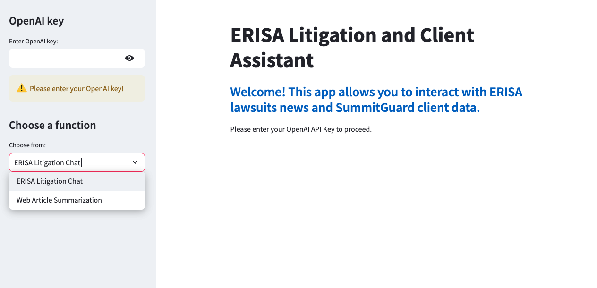
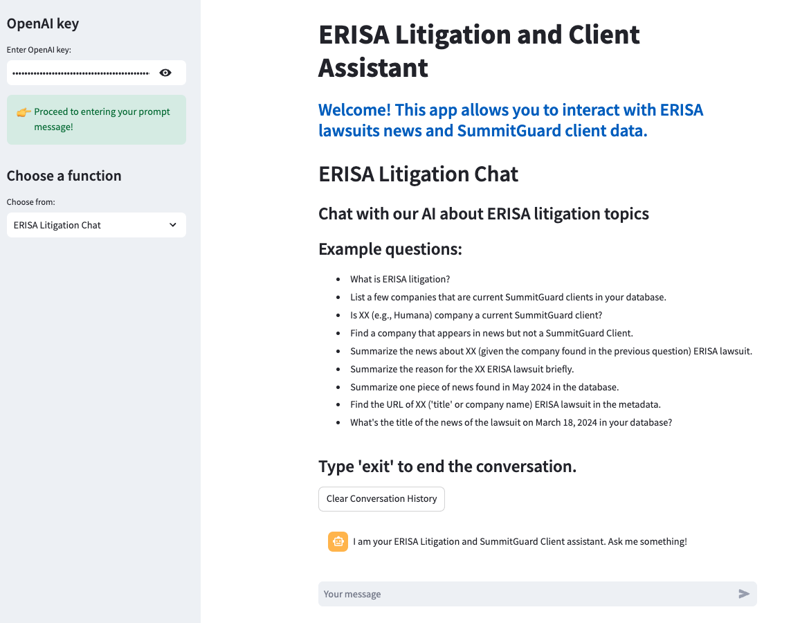
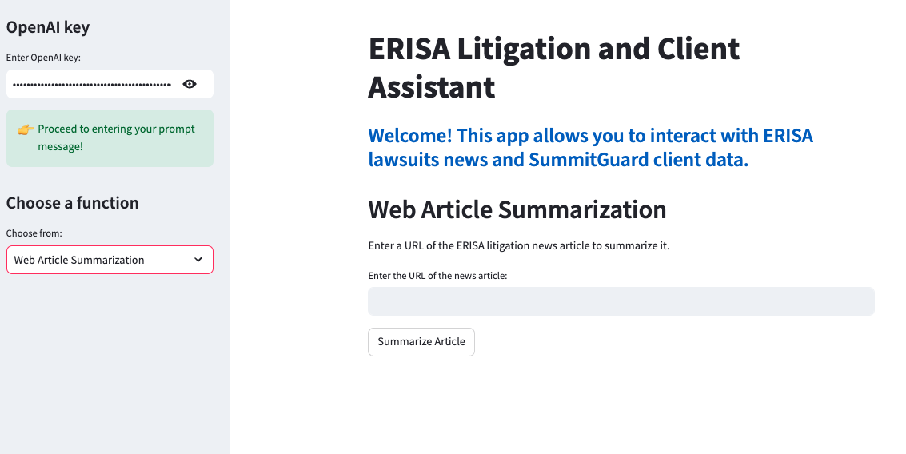

# 📦  ERISA Litigation and Client Assistant with RAG-Based LLMs
```
⬆️ Welcome to ERISA Litigation and Client Assistant!
```

This assistant can extract and summarize information for recent ERISA litigations, answer specific questions and identify potentional clients for a fake financial service company called SummitGuard Captial. 
It has two functionalities: ERISA Litigation Chat and Web Article Summarization. 


## Demo App

[](https://lawchatbot-fzsdigciishywpbzmdox4p.streamlit.app/)

## GitHub Codespaces

[](https://codespaces.new/streamlit/app-starter-kit?quickstart=1)

## Snapshot of the App 

main interface: 

ERISA Litigation Chat: 

Web Article Summarization: 

